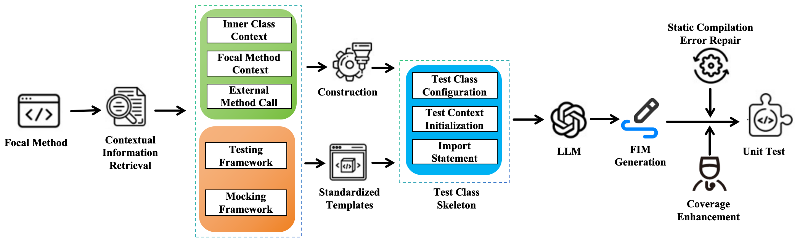
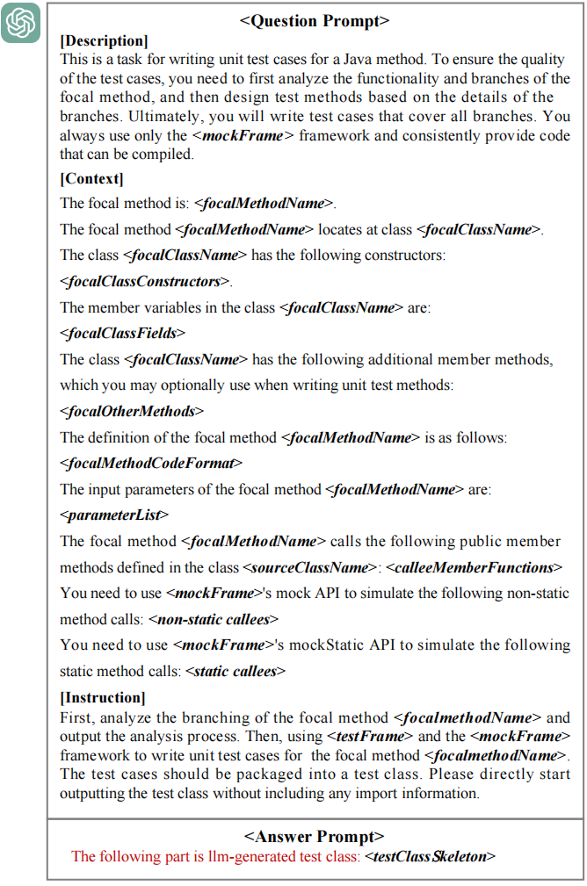
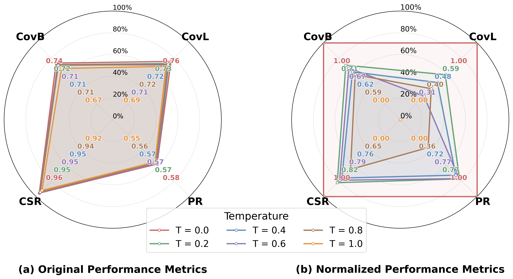
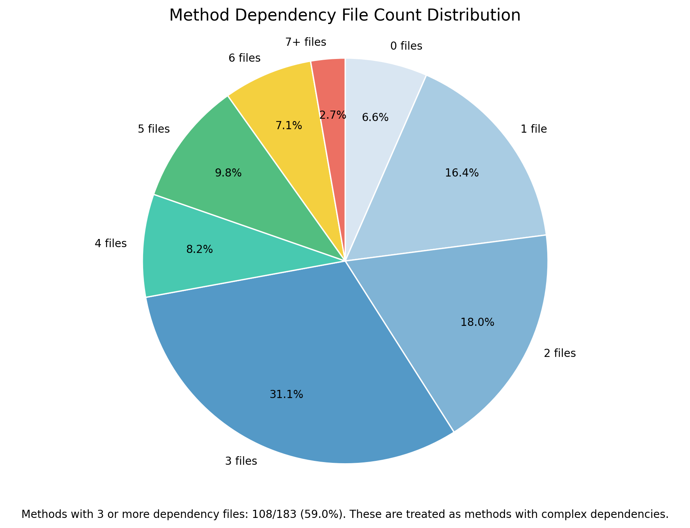

# CATGen

This repository contains the CATGen replication package. Due to confidentiality agreements with our industrial partner, the full source code and proprietary benchmark datasets used in the original study cannot be publicly released. To maximize reproducibility and transparency, this package provides the public artifacts, documentation, examples, and supporting utilities used to explain and replicate the workflow.

## Abstract

Automated unit test generation has recently benefited from advances in large language models (LLMs), yet our industrial deployments reveal a persistent gap between promising research results and practical usability. In real-world projects with complex frameworks and cross-file dependencies, LLM-generated tests frequently fail to compile, require costly manual repair, or provide unstable coverage improvements.
This paper reports our experience in designing, deploying, and evaluating **CATGen**, a context-aware workflow for LLM-based unit test generation, informed by repeated industrial failures and refinements. Rather than relying on LLMs to infer incomplete project context, we found that compilation robustness critically depends on making project-level dependencies explicit, stabilizing test class scaffolding, and replacing iterative LLM-based repair with lightweight static analysis.
These experience-driven insights shaped CATGen's multi-stage design, which combines structured context retrieval, deterministic test skeleton construction, and program-analysis-based post-processing. We evaluate CATGen on real-world complex focal methods from proprietary industrial projects and additionally on the Defects4J benchmark to assess generalizability. Across both settings, CATGen substantially improves compilation success and structural coverage while significantly reducing generation time and token consumption compared to existing LLM-based approaches.

## Overview



## Prompt



## Temperature Study

The repository also includes a temperature-sensitivity experiment figure for comparing generation behavior under different decoding temperatures.



## Dependency Distribution

The repository also includes a dependency distribution figure showing the number of dependency files per method. Methods with 3 or more dependency files are treated as methods with complex dependencies.



## Repository Structure

```text
CATGen/
├── core
├── docs
├── examples
├── pictures
├── results
└── utils
```

- [`core/`](core) contains the core CATGen components.
- [`docs/`](docs) contains structured documentation for the public replication package.
- [`examples/`](examples) contains example artifacts generated by CATGen.
- [`pictures/`](pictures) contains the figures used in the paper and repository documentation.
- [`results/`](results) contains intermediate or generated results released with the package.
- [`utils/`](utils) contains supporting utilities, including the Java parsing and preprocessing modules.

## Documentation Guide

The [`docs/`](docs) directory contains the main written documentation for the CATGen pipeline. Each file focuses on one stage or supporting configuration of the system.

- [`docs/llm-configuration.md`](docs/llm-configuration.md): describes the local LLM setup, evaluated model families, deployment environment, and inference configuration.
- [`docs/static-analysis.md`](docs/static-analysis.md): explains the lightweight static-analysis stage, including its scope, extracted context, and role in the CATGen pipeline.
- [`docs/static-repair-stage.md`](docs/static-repair-stage.md): documents the deterministic post-processing and repair strategies applied to generated tests.
- [`docs/test-skeleton.md`](docs/test-skeleton.md): explains how CATGen constructs deterministic, framework-aware test skeletons before LLM completion.
- [`docs/JUnit5Framework.java`](docs/JUnit5Framework.java): provides a sanitized JUnit 5 template example used to illustrate framework-aware test skeleton generation.

## Java Parser Utilities

The [`utils/java_parser/`](utils/java_parser) module is a lightweight Java parsing utility built on Tree-sitter. It is used to extract class, method, variable, and invocation information from Java projects so that downstream stages can build context for test generation and repair.

### Key Files

- [`utils/java_parser/test.py`](utils/java_parser/test.py): example script for extracting methods from Java source or test files.
- [`utils/java_parser/utils/entry.py`](utils/java_parser/utils/entry.py): project-level parser entry for traversing Java files and building parsed context.
- [`utils/java_parser/utils/method_extractor.py`](utils/java_parser/utils/method_extractor.py): helper for extracting methods from a single Java file.
- [`utils/java_parser/utils/parsers.py`](utils/java_parser/utils/parsers.py): core Tree-sitter-based parsing logic.

### Basic Usage

If you want to parse methods from a single Java file, you can start from [`utils/java_parser/utils/method_extractor.py`](utils/java_parser/utils/method_extractor.py) and call `extract_methods(...)`.

If you want to parse an entire Java project, you can use [`utils/java_parser/utils/entry.py`](utils/java_parser/utils/entry.py):

```python
from utils.entry import ContextParser

parser = ContextParser()
parser.parse("/path/to/java/project")

parsed_classes = parser.parsed_classes
```

For a simple standalone example, see [`utils/java_parser/test.py`](utils/java_parser/test.py).

## Notes

- The repository contains sanitized and partial artifacts intended for replication and explanation.
- Some original industrial assets are intentionally omitted due to confidentiality constraints.
- Documentation in [`docs/`](docs) is the best starting point for understanding the released workflow.
